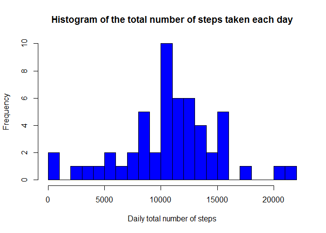

# Reproducible Research: Peer Assessment 1


## Loading and preprocessing the data
Task-1 : Load the data.      
To load the data first we have to download the zip file and unzip the file
in activitydata folder. Then read the csv file from unzipped folder.

```r
if(!file.exists("activitydata")){dir.create("activitydata")}
download.file("https://d396qusza40orc.cloudfront.net/repdata%2Fdata%2Factivity.zip",destfile="activitydata/Dataset.zip")
unzip(zipfile="activitydata/Dataset.zip",exdir="activitydata")
actData <- read.csv("activitydata/activity.csv", head=TRUE, colClasses=c("integer", "character", "integer"), na.strings="NA")
```

Task-2 : Process/transform the data.     
The actData data frame contains a date column as character type. Now we have to convert the date column as date type.

```r
actData$date <- as.Date(actData$date)
```

## What is mean total number of steps taken per day?
Task-1 : Histogram of the total number of steps taken each day.  
For this task of the assignment, we can ignore the missing values in the dataset.     

First we remove the NA column then calculate the sum of steps per day  and plot a histogram of steps taken each day.

```r
actDataNoNa <- actData[complete.cases(actData),]
dailySteps <- aggregate(steps ~ date, actDataNoNa, sum)

hist(x=dailySteps$steps,
     col="blue",
     breaks=20,
     xlab="Daily total number of steps",
     ylab="Frequency",
     main="Histogram of the total number of steps taken each day")
```

<!-- -->

Task-2 : Calculate and report the mean and median of the total number of steps taken per day.   

Mean of the total number of steps taken per day:

```r
mean(dailySteps$steps)
```

```
## [1] 10766.19
```

Median of the total number of steps taken per day

```r
median(dailySteps$steps)
```

```
## [1] 10765
```

## What is the average daily activity pattern?
Task-1 : Time series plot of the average number of steps taken.     
For this task we ignore the NA values and then calculate the mean for 5-minute interval. Draw a line plot of average steps for each 5-minute interval.

```r
actDataNoNa <- actData[complete.cases(actData),]
steps5MinInterval <- aggregate(steps ~ interval, actDataNoNa, mean)

plot(
        x = steps5MinInterval$interval,
        y = steps5MinInterval$steps,
        type = "l",
        main = "Time Series Plot of the 5-Minute Interval\n and the Average Number of Steps Taken, Averaged Across All Days",
        xlab = "5-Minute Interval",
        ylab = "Average Number of Steps Taken,\n Averaged Across All Days"
)
```

<!-- -->

Task-2 : The 5-minute interval that, on average, contains the maximum number of steps.     

```r
steps5MinInterval[steps5MinInterval$steps==max(steps5MinInterval$steps),]
```

```
##     interval    steps
## 104      835 206.1698
```


## Imputing missing values

Task-1 : Calculate and report the total number of missing values in the dataset (i.e. the total number of rows with NAs).    

```r
nrow(actData[is.na(actData$steps),])
```

```
## [1] 2304
```

Task-2 : Devise a strategy for filling in all of the missing values in the dataset. The strategy does not need to be sophisticated. For example, you could use the mean/median for that day, or the mean for that 5-minute interval, etc.    
Answer : The mean for that 5-minute interval will bw used to fill the missing values.
  
Task-3 : Create a new dataset that is equal to the original dataset but with the missing data filled in.    
New dataset actDataWithFill is created by filling missing data in actData.

```r
actDataWithFill <- actData
indexOfNA <- is.na(actDataWithFill$steps)
mean5MinInterval <- tapply(actDataWithFill$steps, actDataWithFill$interval, mean, na.rm=TRUE)
actDataWithFill$steps[indexOfNA] <- mean5MinInterval[as.character(actDataWithFill$interval[indexOfNA])]
nrow(actDataWithFill[is.na(actDataWithFill$steps),])
```

```
## [1] 0
```

Task-4 : Make a histogram of the total number of steps taken each day and Calculate and report the mean and median total number of steps taken per day.
     
Histogram of the total number of steps taken each day after filling missing values:

```r
dailyStepsWithFill <- aggregate(steps ~ date, actDataWithFill, sum)

hist(
        dailyStepsWithFill$steps,
        col = "blue",
        main = "Histogram of the total number of steps taken each day\n after filling missing values",
        xlab = "Total Number of Steps Taken Each Day",
        breaks = 20,
        ylim =c(0,20)
)
```

<!-- -->

Mean of total number of steps taken per day after filling missing values:

```r
mean(dailyStepsWithFill$steps)
```

```
## [1] 10766.19
```

Median of total number of steps taken per day after filling missing values:

```r
median(dailyStepsWithFill$steps)
```

```
## [1] 10766.19
```

Do these values differ from the estimates from the first part of the assignment?    
  
They do differ, but ever so slightly.
  
mean(dailySteps) = 10766.19, while mean(dailyStepsWithFill) = 10766.19. Produces the same value.
  
median(dailySteps) = 10765, while median(dailyStepsWithFill) = 10766.19. Only 1 point difference in median.

## Are there differences in activity patterns between weekdays and weekends?

Task-1 : Create a new factor variable in the dataset with two levels - "weekday" and "weekend" indicating whether a given date is a weekday or weekend day.     
For this task use the dataset after filling missing data actDataWithFill.
Create factor variable daytype in actDataWithFill.

```r
weekend <- weekdays(as.Date(actDataWithFill$date)) %in% c("Saturday", "Sunday")
actDataWithFill$daytype <- "weekday"
actDataWithFill$daytype[weekend == TRUE] <- "weekend"
actDataWithFill$daytype <- as.factor(actDataWithFill$daytype)
str(actDataWithFill)
```

```
## 'data.frame':	17568 obs. of  4 variables:
##  $ steps   : num  1.717 0.3396 0.1321 0.1509 0.0755 ...
##  $ date    : Date, format: "2012-10-01" "2012-10-01" ...
##  $ interval: int  0 5 10 15 20 25 30 35 40 45 ...
##  $ daytype : Factor w/ 2 levels "weekday","weekend": 1 1 1 1 1 1 1 1 1 1 ...
```

Task-2 : Make a panel plot containing a time series plot (i.e. type = "l") of the 5-minute interval (x-axis) and the average number of steps taken, averaged across all weekday days or weekend days (y-axis).     
  
First calculate the mean of steps group by daytype and interval and then draw a lattice plot by daytype and 5-minute intervals.

```r
mean5MinIntervalDayType <- aggregate(steps ~ interval + daytype, actDataWithFill, mean)

library(lattice)
xyplot(
        steps ~ interval | daytype,
        mean5MinIntervalDayType,
        type = "l",
        layout = c(1,2),
        main = "Time Series Plot of the 5-Minute Interval\nand the Average Number of Steps Taken,\nAveraged Across All Weekday Days or Weekend Days",
        xlab = "5-Minute Interval",
        ylab = "Average Number of Steps Taken"
)
```

<!-- -->
